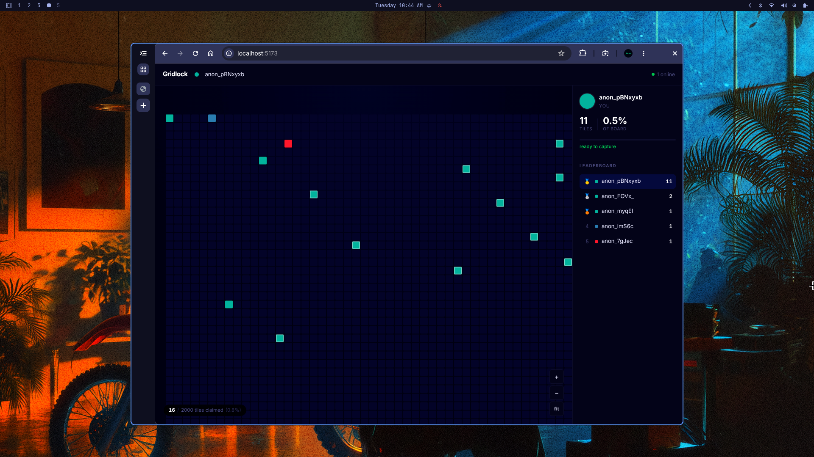

# Gridlock

A real-time shared grid where anyone can claim tiles. Open it in two tabs and watch them fight over territory.



---

## What it does

- 50×40 grid (2000 tiles) rendered in the browser
- Click any tile to claim it — it turns your color
- Every other connected user sees your claim instantly, no refresh
- 3-second cooldown between claims — you can steal someone else's tile, but only one at a time
- Live leaderboard, online user count, and board coverage stats
- Zoom (scroll wheel) and pan (drag) to navigate the grid

---

## Running it

You need Node.js 18+.

```bash
# Install dependencies
npm install
npm install --prefix server
npm install --prefix client

# Start both server and client
npm run dev
```

Server runs on `:3001`, client on `:5173`.

To test multi-user locally, open `http://localhost:5173` in two browser tabs. They'll get different colors and see each other's claims live.

---

## Tech stack and why

**Backend: Node.js + Express + Socket.io**

Node's single-threaded event loop is actually an advantage here — concurrent claim events are processed sequentially, so there's no risk of two users claiming the same tile simultaneously and getting conflicting state. No mutex needed.

Socket.io sits on top of WebSockets and handles the persistent connections. When a user claims a tile, the server broadcasts to every connected client in one call (`io.emit`). HTTP polling would mean up to a second of lag; WebSockets push the update in under 10ms.

**Frontend: React + Vite**

The grid is 2000 DOM nodes. React's reconciliation + `React.memo` on the Cell component means only the one changed cell re-renders on each claim event — the other 1999 are skipped. Vite gives fast HMR during development.

**Storage: in-memory**

Grid state lives in a plain JS array on the server. Fast reads and writes, zero setup. The tradeoff is that state resets when the server restarts — acceptable for this scope. Persisting to Redis or Postgres would be a straightforward addition: swap the array for a hash in Redis, emit the same events, nothing else changes.

---

## How the real-time layer works

Every browser tab opens a WebSocket connection to the server on load. Socket.io gives each connection a unique ID and an event bus.

```
Browser tab (Alice)          Server                    Browser tab (Bob)
      |                         |                              |
      |--- connect ------------>|                              |
      |<-- hello (full grid) ---|                              |
      |                         |<--------- connect -----------|
      |                         |---------- hello (full grid)->|
      |                         |                              |
      |--- claim(idx: 42) ----->|                              |
      |                         |-- claimed(42, Alice) ------->|  (broadcast)
      |<-- claimed(42, Alice) --|                              |
      |                         |                              |
```

Two key distinctions:

- `socket.emit(...)` — sends to one specific client
- `io.emit(...)` — sends to every connected client simultaneously

When Alice claims tile 42, the server validates (bounds check, cooldown), updates the grid array, then calls `io.emit('claimed', { idx: 42, color: ..., name: ... })`. Bob's browser receives this event and React updates cell 42 — without Bob doing anything.

The cooldown is enforced server-side. The client starts its own countdown for the UI, but even if someone bypasses it and spams `socket.emit('claim')`, the server checks `Date.now() - user.lastCapture` and returns a `denied` event. The grid state only changes when the server says so.

---

## Project structure

```
├── server/
│   └── index.js          # Express + Socket.io, grid state, event handlers
└── client/
    └── src/
        ├── App.jsx        # Socket lifecycle, grid state, cooldown timer
        ├── socket.js      # Socket.io singleton
        └── components/
            ├── Grid.jsx   # Zoom/pan, cell rendering
            ├── Cell.jsx   # Individual tile (memoized)
            ├── Header.jsx # Username editor, online count
            ├── Sidebar.jsx
            ├── UserCard.jsx   # Your stats + cooldown bar
            └── Leaderboard.jsx
```

---

## Design decisions

**Why not Canvas?**
CSS Grid with `React.memo` handles 2000 tiles cleanly. Canvas would be faster at very large scale but loses browser-native accessibility, hover states, and CSS transitions for free. For this grid size, the DOM approach is the right tradeoff.

**Why does drag not trigger a claim?**
The grid tracks whether the mouse moved more than 4px between `mousedown` and `mouseup`. If it did, the click is treated as a pan, not a claim. This makes the zoom/pan feel natural — you're not accidentally claiming tiles while navigating.

**Why a color palette instead of letting users pick?**
Assigned colors keep the leaderboard readable at a glance. With free color picking, two users could pick the same color and their tiles would be indistinguishable. The 20-color palette cycles by connection order.
